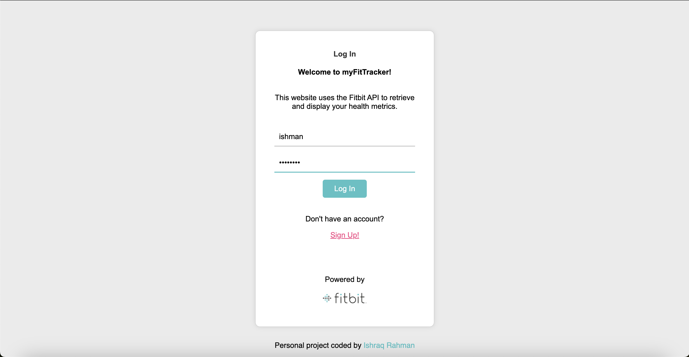
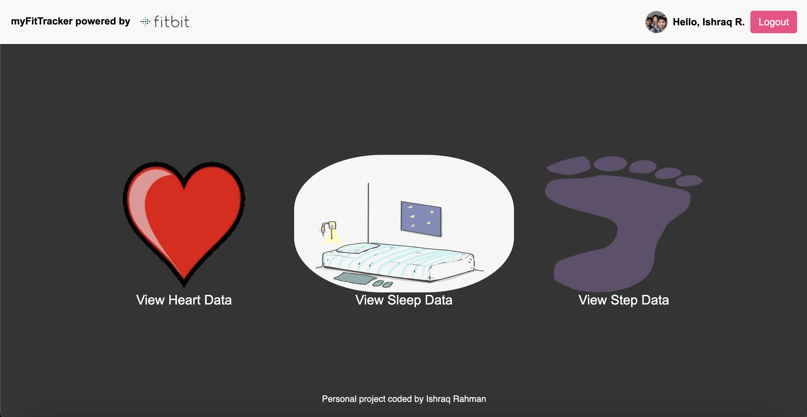
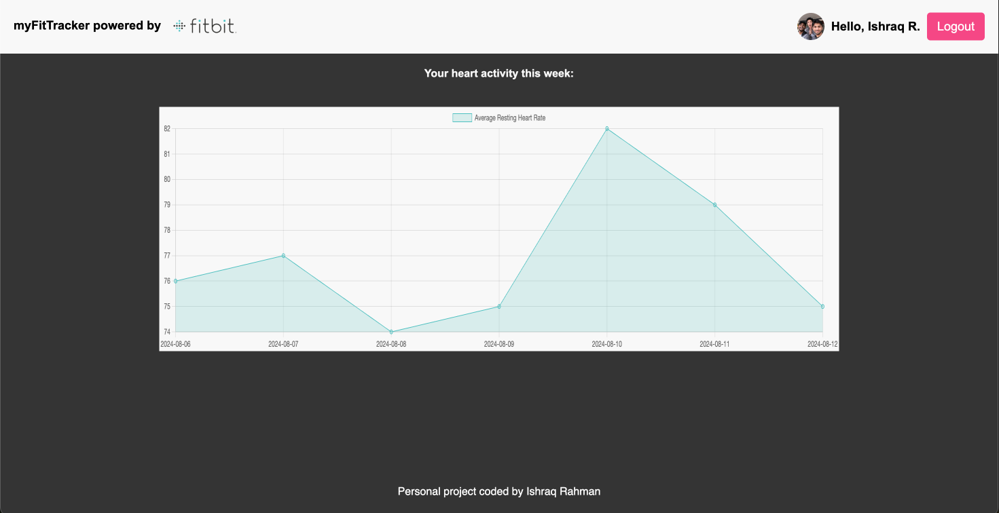

Personal Project myFitTracker Web Application
===========================
# myFitTracker

myFitTracker is a personal project that utilizes the Fitbit API to gather and display health metrics such as heart rate, sleep data, and step counts. This web application allows users to log in, connect their Fitbit account, and visualize their health data through an interactive dashboard.

## Features

- **User Authentication:** Users can sign up and log in with their credentials
- **Fitbit Integration:** Users can connect their Fitbit account to the application to fetch and display health metrics
- **Health Data Visualization:** Users can view their average resting heart rate, sleep patterns, and step counts over the past week through dynamic charts

## Screenshots

## Technologies Used:

- **Node.js:** JavaScript runtime for server-side programming
- **Express.js:** Web framework for building the server
- **MongoDB:** Database for storing user information
- **EJS:** Embedded JavaScript templates for rendering dynamic web pages
- **Chart.js:** JavaScript library for creating interactive charts
- **Fitbit API:** API for accessing Fitbit health metrics
- **Session Management:**  Managed with 'express-session'

## Future Enhancements

- **Enhanced Security:** Implement HTTPS and secure cookies for session management
